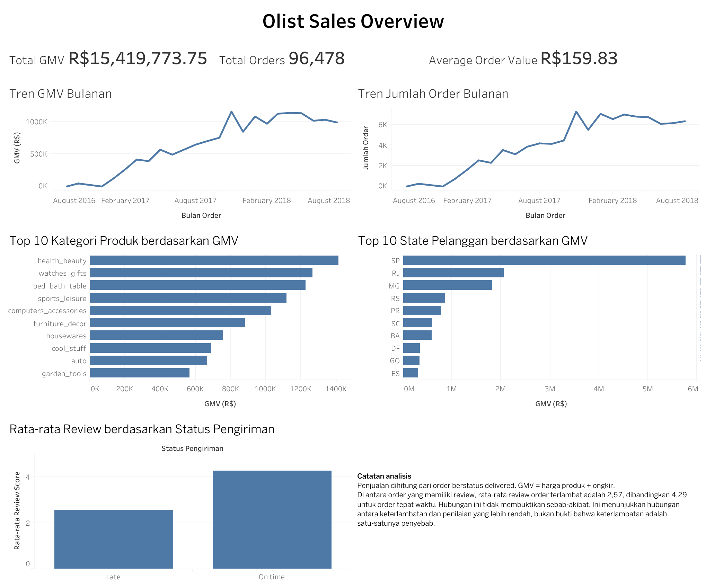

# E-Commerce Sales Analytics — Olist

## Dashboard

**[Lihat dashboard interaktif di Tableau Public](https://public.tableau.com/app/profile/muhammad.jundullah3944/viz/Olist_Sales_Overview_17899034964280/OlistSalesOverview?publish=yes)**

[Unduh packaged workbook Tableau](dashboard/Olist_Sales_Overview.twbx).

Dashboard menyajikan:

- Total GMV, Total Orders, dan Average Order Value.
- Tren GMV dan jumlah order bulanan.
- Kategori produk dengan GMV tertinggi.
- State pelanggan dengan GMV tertinggi.
- Perbandingan review score berdasarkan status pengiriman.

## Ringkasan

Project ini menganalisis performa penjualan e-commerce menggunakan [Brazilian E-Commerce Public Dataset by Olist](https://www.kaggle.com/datasets/olistbr/brazilian-ecommerce).

Analisis berfokus pada tren transaksi, kontribusi kategori produk dan wilayah customer, pembelian ulang, serta hubungan antara keterlambatan pengiriman dan review pelanggan.

Data diolah menggunakan **MySQL** dan divisualisasikan menggunakan **Tableau Public**.

## Pertanyaan Bisnis

1. Bagaimana tren GMV dan jumlah order dari bulan ke bulan?
2. Kategori produk mana yang menyumbang GMV terbesar?
3. State pelanggan mana yang menyumbang GMV terbesar?
4. Berapa banyak customer yang melakukan pembelian berulang?
5. Apakah order terlambat memiliki review score lebih rendah?

## Tools dan Workflow

- **MySQL:** data preparation, data-quality checks, eksplorasi, dan business analysis.
- **Tableau Public:** visualisasi dan pembuatan dashboard.
- **Git dan GitHub:** version control dan dokumentasi project.

Alur analisis:

1. Mengimpor dataset Olist ke MySQL.
2. Memeriksa kelengkapan, duplikasi, dan relasi data.
3. Menghitung KPI dan menjawab pertanyaan bisnis.
4. Membuat dataset level order dan level item untuk Tableau.
5. Membuat dashboard dan menyusun rekomendasi bisnis.

## Definisi Metrik

Analisis penjualan menggunakan order dengan status `delivered`.

- **Total Orders:** jumlah `order_id` unik.
- **GMV:** jumlah harga produk dan ongkir (`price + freight_value`).
- **AOV:** GMV dibagi jumlah order unik.
- **Repeat Customer:** customer dengan lebih dari satu order `delivered`, dikenali melalui `customer_unique_id`.
- **Late Delivery:** tanggal penerimaan customer melewati tanggal estimasi pengiriman.
- **Review Score:** rata-rata review pada order yang memiliki data review.

Nilai GMV dan AOV menggunakan Brazilian Real (`R$`). GMV menunjukkan nilai transaksi berdasarkan definisi project ini dan tidak mewakili laba atau pendapatan bersih Olist.

## Temuan Utama

- Sebanyak **96.478 delivered orders** menghasilkan GMV **R$ 15.419.773,75**, dengan AOV **R$ 159,83**.
- November 2017 memiliki GMV bulanan tertinggi, yaitu **R$ 1.153.364,20** dari **7.289 order**.
- `health_beauty` merupakan kategori dengan GMV tertinggi, yaitu **R$ 1.412.089,53**.
- State **SP** menyumbang GMV terbesar, yaitu **R$ 5.769.703,15**.
- Sebanyak **2.801 dari 93.358 customer** melakukan pembelian lebih dari sekali, setara dengan **3,00%**.
- Repeat customer menyumbang GMV **R$ 864.187,46**, atau sekitar **5,60%** dari total GMV.
- Order terlambat yang memiliki review mendapatkan rata-rata review score **2,57**, dibandingkan **4,29** untuk order tepat waktu.
- Perbedaan review tersebut menunjukkan hubungan antara keterlambatan dan penilaian yang lebih rendah, tetapi tidak membuktikan hubungan sebab-akibat.

## Rekomendasi Bisnis

- Pantau jumlah order dan GMV secara bersamaan ketika mengevaluasi performa kategori produk.
- Jaga kualitas layanan di SP karena state tersebut memberikan kontribusi GMV terbesar.
- Analisis jarak waktu dan kategori pembelian repeat customer sebelum membuat program retensi.
- Telusuri keterlambatan berdasarkan seller dan wilayah untuk menemukan kelompok yang perlu diprioritaskan.
- Pantau perubahan review score setelah perbaikan ketepatan pengiriman.

Pembahasan lengkap tersedia pada [Temuan dan Rekomendasi Bisnis](insights/business_recommendations.md).

## Struktur Repository

~~~text
.
├── dashboard/
│   └── Olist_Sales_Overview.twbx
├── dashboard_data/
│   ├── dashboard_order_items.csv
│   └── dashboard_orders.csv
├── images/
│   └── olist_sales_overview.png
├── insights/
│   └── business_recommendations.md
├── sql/
│   ├── 00_scratch_history.sql
│   ├── 01_setup_and_import.sql
│   ├── 02_data_quality_checks.sql
│   ├── 03_exploration.sql
│   ├── 04_business_analysis.sql
│   └── 05_tableau_export.sql
├── .gitignore
├── analysis_plan.md
└── README.md
~~~

SQL utama:

- [Setup dan import data](sql/01_setup_and_import.sql)
- [Data-quality checks](sql/02_data_quality_checks.sql)
- [Eksplorasi data](sql/03_exploration.sql)
- [Business analysis](sql/04_business_analysis.sql)
- [Tableau export](sql/05_tableau_export.sql)
- [Riwayat query eksplorasi](sql/00_scratch_history.sql)

## Cara Menjalankan Project

1. Unduh dataset dari [Kaggle](https://www.kaggle.com/datasets/olistbr/brazilian-ecommerce).
2. Letakkan seluruh raw CSV di root folder project.
3. Sesuaikan lokasi CSV pada [01_setup_and_import.sql](sql/01_setup_and_import.sql).
4. Jalankan file SQL berikut secara berurutan:
   - `01_setup_and_import.sql`
   - `02_data_quality_checks.sql`
   - `03_exploration.sql`
   - `04_business_analysis.sql`
   - `05_tableau_export.sql`
5. Ekspor hasil query pada `05_tableau_export.sql` menjadi:
   - `dashboard_data/dashboard_orders.csv`
   - `dashboard_data/dashboard_order_items.csv`
6. Buka [Olist_Sales_Overview.twbx](dashboard/Olist_Sales_Overview.twbx) menggunakan Tableau Public.
7. Refresh data source jika lokasi CSV berbeda.

## Batasan Analisis

- Dataset tidak menyediakan biaya operasional, laba, promosi, atau target bisnis.
- Sebagian order tidak memiliki review.
- Delapan delivered orders tidak memiliki tanggal pengiriman lengkap dan diberi status `Unknown`.
- Perbandingan pengiriman hanya menggunakan order dengan tanggal pengiriman lengkap.
- Hubungan antara keterlambatan dan review score tidak membuktikan bahwa keterlambatan merupakan satu-satunya penyebab review rendah.
- Hasil analisis menggambarkan periode yang tersedia dalam dataset dan tidak mewakili kondisi bisnis saat ini.

## Sumber Data

[Brazilian E-Commerce Public Dataset by Olist — Kaggle](https://www.kaggle.com/datasets/olistbr/brazilian-ecommerce)
